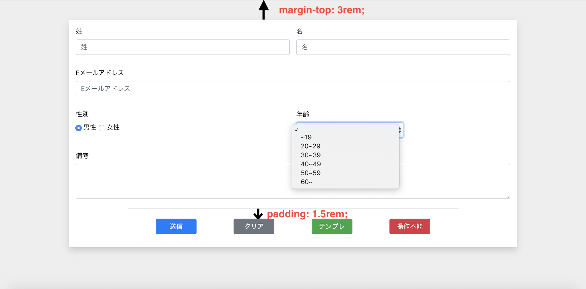

# Bootstrap レイアウト編

## 目標時間

6時間〜8時間程度

## 目的

下記画像の内容を課題通りに実装することで、Bootstrapの使い方に慣れる。  


## 実装

### 準備
`resources/views` 下に `index.blade.php` を作成

index.blade.php
```php
<!DOCTYPE html>
<html lang="ja">
<head>
  <meta charset="UTF-8">
  <title>test</title>
  <link rel="stylesheet" href="https://stackpath.bootstrapcdn.com/bootstrap/4.4.1/css/bootstrap.min.css" integrity="sha384-Vkoo8x4CGsO3+Hhxv8T/Q5PaXtkKtu6ug5TOeNV6gBiFeWPGFN9MuhOf23Q9Ifjh" crossorigin="anonymous">
  <style>
    body {
      background-color: #eee;
    }
    button {
      width: 100px;
    }
    .wrapper {
      width: 1100px;
    }
  </style>
</head>
<body>
  <div class="wrapper"></div>
</body>
</html>
```

TestContoroller(書き換え)
```php
/**
* index.blade.phpを返す
*/
public function index()
{
    return view('index');
}
```

これで準備は完了です。

### 補足
- linkタグでBootstrapを読み込んでいます。ですが、まだclassしか読み込んでいませんのでBootstrapの全ての機能が使えるわけではありません。（今回の実装には問題ありません。）
- 自作のcssを読み込むときはBootstrapのlinkタグより下に記述します。
（今回はBootstrapの課題ですので、使わないでください）

### 課題

下記の条件に従いBootstrapを用いて実装してください。

- 画像（index.png）の通りにformを作成して下さい。(画像はimgフォルダの中にあります。)
- 各項目のname属性はそれぞれ`familyName`, `firstName`, `e-mail`, `sex`, `age`, `note`とし、性別以外はid属性もname属性と同じで結構です。性別はid属性を`male`,` female`としてください。
- 各ボタンのid属性は`submit-btn`, `clear-btn`, `temp-btn`, `disabled-btn`としてください。
- type属性はそれぞれ適切なものにしてください。
- 送信ボタンの色は`primary`です。
- クリアボタンを押すとformの内容がリセットされるようにしてください。色は`secondary`です。
- テンプレボタンの色は`success`です。
- 操作不能ボタンの色は`danger`です。
- padding,marginについて
    - 指示がある場所以外に、指定する必要がある場合は`0.5rem`を指定してください

すこし見慣れない指定があると思いますが、Bootstrapの使い方をしっかり調べて取り組んでみましょう。

完成したら3_js.mdに進んでください。
