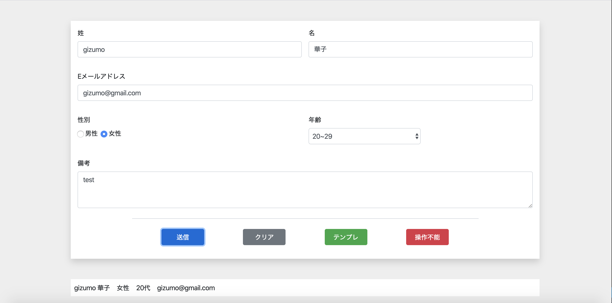
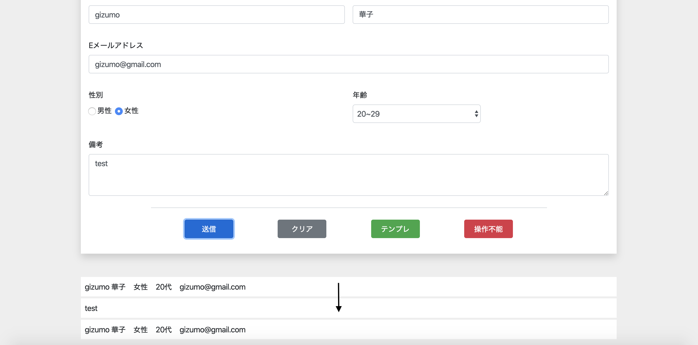

# PHP基礎 & Ajax

## 目標時間

8時間〜10時間程度

## 目的

- 動的なviewを作成できるようになる
- Ajaxの使い方を学ぶ

## 準備

- 追加
    - view
        - resources/views 下に、list.blade.phpを作成する。
    - controller
        - list.blade.phpを返すように記述する
    - ルーティング
        - web.phpに追加する。
        - 条件：postでやること

- 追記
    - index.blade.php
        - formタグの下にid="testList"を持つulタグを記述する
    ```
    <ul id="testList" class="mt-5"></ul>
    ```
    - formタグに、action、method、idを追加する
        - 上記でweb.phpに記述したルートに従い記入する


- 動的なviewを作成しlist.blade.phpに追記する。  
下記静的html
```
<li class="mb-1">
    <div class="">
        <div class="p-2"></div>
        <div class="p-2"></div>
        <div class="p-2"></div>
        <div class="p-2"></div>
    </div>
    <div class="mt-1" style="display: none;">
        <p class="p-2 m-0"></p> // ここに備考
    </div>
</li>
```

## 補足

今回は準備も課題のようになっています。わからない場合は以前やったところを見返してみるか、調べてやってみましょう。

## 課題

下記に従い処理を実装してください

- 送信ボタンを押したとき、上記で作成したメソッドに対してAjax通信を行いformの内容をcontrollerに送信する。
- 受け取った値を使い動的なviewをreturnする。
- Ajax成功時帰ってきたHTMLをulに表示する
    - たりないclassもあるのでしっかり見本のように仕上げること


- 表示したliをクリックするとそのliに対応する備考がスライドダウンし、もう一度クリックするとスライドアップする


完成したら終了です。お疲れさまでした。


