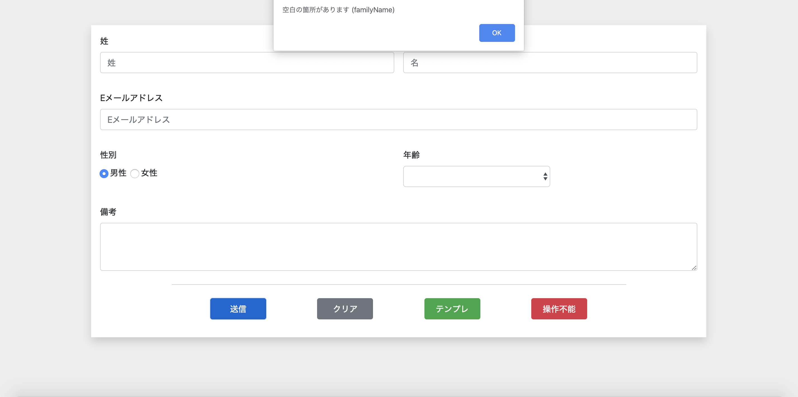
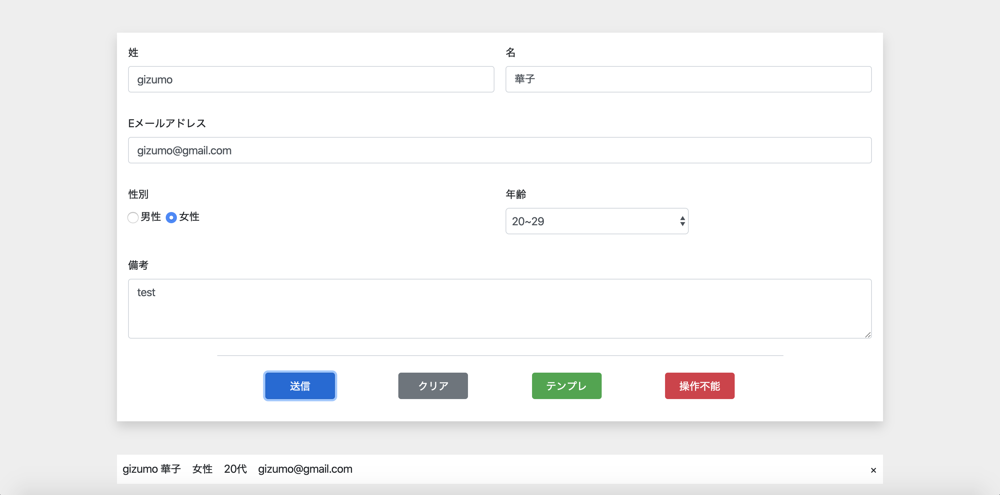
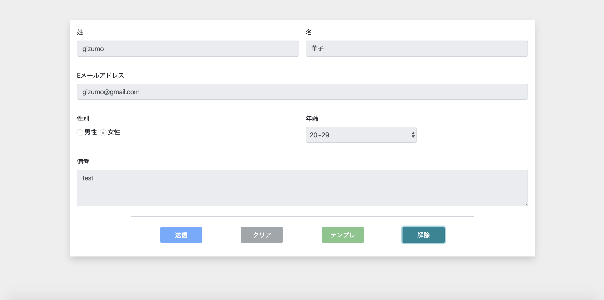

# EX課題

基本部分は完成しましたが、まだまだ甘いところがありますね。それらを解決していきたいと思います。

## 目標時間

4時間〜7時間程度

## 課題

- バリデーションの追加
- リストの削除機能の追加
- 操作不能ボタンの改良
- jsの難読化

### バリデーションの追加（目標時間:2時間）

今回は簡単に実装していきたいと思います。条件さえ満たしていればどんな方法でも構いません。

- 送信ボタンを押したとき、未入力が存在した場合、アラートメッセージを出し処理を終了するようにしてください。

- アラートが出たときはリストが追加されないようにしてください。
- 入力内容を改めてから再度送信ボタンを押した場合はリストが正常に追加されるようにしてください。

### 削除機能の追加（目標時間:2時間）

- 追加されるリストに閉じるボタン（×）を追加してください。

- hover時カーソルをpointerに変更してください。
- 閉じるボタンをクリックすると対応するリストが削除されるようにしてください。

### 操作不能ボタンの改良（目標時間:1時間）

操作不能ボタンを押すと操作不能になり操作不能ボタンをもう一度押すと操作不能が解除される、、、  
というのが今までだと思いますが、少し難しいですよね。なのでここを改修します。

- 操作不能ボタンを押すと記述が解除に変わるようにしてください。
- 色を`danger`から`info`に変化するようにしてください。
- 解除ボタンを押すと操作不能が解除されるようにしてください。
- ボタンの記述が解除から操作不能に戻り、色も`info`から`danger`へ変化するようにしてください。

### jsの難読化（目標時間:30分）

上記二点で実装は終了です。お疲れさまでした！ですがこのまま世に出してしまうとコードをデベロッパーツール上で書き換えられ期待通りの挙動をしない場合があります。  
その危険性を少しでも軽減するためjsのコードをツールを使って難読化しましょう。  
※ツールの指定はありません。

これで完全に終了です。お疲れさまでした。
